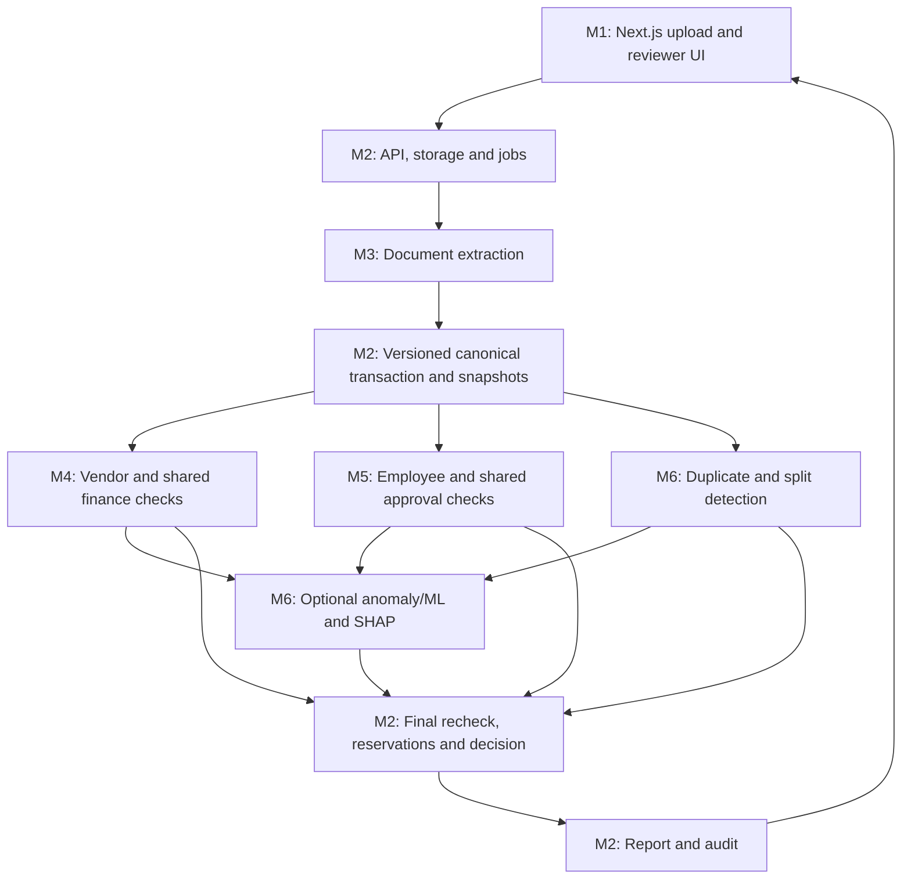

# Accounts-Payable Exception Assistant: Six-Person Work Plan

Team: AI BATTALION 1 · Team ID 152 · Microsoft Innovate 2026

Companion specification: `AP_Exception_Assistant_Codex_Spec.md`.

## 1. The recommended split

Build six modules in one repository. Each person owns a complete module, its tests, sample inputs/outputs and handoff documentation. Agree on shared interfaces first, then use fixtures and mocks to work in parallel. Independence means a module can run and be tested without another person's unfinished implementation; it does not mean building six unrelated applications.

Assignments below are proposals based on the known team roster, not assumptions about anyone's skills. Swap people if needed while keeping the module boundaries. Vansh remains team lead.

| Person | Module | Main responsibility | Concrete handoff |
|---|---|---|---|
| **Vansh Joshi** | M1 — Frontend and reviewer workspace | All user-facing screens and browser flows; integration coordination | Working Next.js application that runs against mock or real APIs |
| **Krishna Gaur** | M2 — Backend platform and integration | FastAPI, database, storage, jobs, authorization, final decision, audit and deployment wiring | Running API/worker/database with a complete evaluation orchestrator |
| **Anant Arya** | M3 — Document processing and extraction | PDF/image processing, TypeLLM/VLM adapter, normalization and field provenance | Document-to-canonical-data package with fixtures and extraction benchmark |
| **Ansh Upadhyay** | M4 — Vendor checks and shared finance calculations | Vendor/PO/contract/GRN matching, arithmetic and pure budget checks | Deterministic vendor and shared-finance rule package |
| **Akash Maurya** | M5 — Employee checks and approval policy | Employee/expense/receipt-policy checks and approval requirements for both branches | Deterministic expense and approval-rule package |
| **Priyanshi Goyal** | M6 — Duplicate detection, anomaly/ML and explanations | Shared duplicate engine, historical features, risk scoring, SHAP and feedback datasets | Matching/risk package with evidence, benchmarks and optional model |

M2 has the widest infrastructure scope. Its first delivery should use local storage, PostgreSQL jobs and simple development identity; advanced cloud operations come later. Every member owns tests and documentation for their module. Vansh coordinates integration, but is not expected to repair everybody's code at the end.

## 2. Freeze these agreements before coding

Hold one short kickoff and commit a `contracts-v1` package with sample fixtures. This is the most important dependency for parallel work.

### 2.1 Non-negotiable shared conventions

- One repository, one FastAPI application and one PostgreSQL schema. Do not create six competing servers/databases.
- Python for M2–M6; TypeScript/Next.js for M1. Reuse the stack in the main specification.
- UUIDs identify internal records. Display invoice numbers and fingerprints are separate fields.
- All records/evidence carry tenant/entity context. Server authentication supplies the trusted tenant.
- Financial amounts are decimal strings in JSON and Decimal in Python, always with a currency.
- Missing values use explicit null/status, never silently zero or PASS.
- Final decision: `PASS`, `REVIEW`, `HOLD`. A screening PASS does not execute payment.
- Rule status: `PASS`, `FAIL`, `UNKNOWN`, `NOT_APPLICABLE`, `ERROR`.
- Rule decision effect: `NONE`, `REVIEW`, `HOLD`.
- Every finding carries rule/version and evidence IDs. No unsupported fraud accusations.
- Core finance/risk modules receive immutable inputs and return outputs; M2 alone owns operational database writes and finalization.
- All policy thresholds, dates and reference versions come from inputs; no hidden hard-coded company policy or live clock inside a rule.

### 2.2 Shared contracts

Krishna maintains the shared Pydantic models and generated OpenAPI contract; each producer and consumer reviews its relevant types. This is contract stewardship, not unilateral authority to break another module.

| Contract | Minimum contents | Producer → consumer |
|---|---|---|
| `DocumentBundle` | Document/page IDs, safe artifact references, source type, tenant/entity, integrity metadata | M2 → M3 |
| `ExtractionResult` | Canonical draft, raw fields, quality/validation findings, field provenance, document fingerprints, extractor versions | M3 → M2; fingerprints eventually → M6 |
| `CanonicalTransaction` | ID/version, branch, party, dates, decimal amounts/currency, lines/items, source refs | M2 packages M3 or import output → M4/M5/M6 |
| `ReferenceSnapshot` | Pinned vendor/employee/PO/contract/GRN/policy/budget/approval versions and completeness/freshness | M2 → M4/M5/M6 |
| `HistorySnapshot` | Scoped history, query cutoff, source IDs, prior allocations and candidate-search coverage | M2 repository adapters → M4/M5/M6 |
| `EvaluationContext` | Canonical transaction, references/history, evaluation time, versions, mode | M2 → M4/M5/M6 |
| `RuleResult` | Rule/version, status/effect, observed/expected values, reason code, evidence | M3 validation/M4/M5/M6 → M2 |
| `DuplicateResult` | Candidate IDs/versions, exact/fuzzy/image signals, search completeness, rule findings | M6 → M2 and M6 feature builder |
| `RiskAssessment` | Model status/version, score kind/value, applicability, explanation, recommended review flag | M6 → M2 |
| `AllocationProposal` | PO/GRN/receipt/budget targets, quantities/amounts, basis, snapshot/version | M4/M5 → M2 atomic finalizer |
| `ApprovalRequirement` | Policy/version, required steps/roles, completed/missing/invalid actions, automatic-tier applicability | M5 → M2 |
| `EvaluationReport` | Final decision/completeness, rule findings, evidence, scores, allocations/approvals, next actions | M2 → M1 |
| `ReviewAction` | Typed action, expected versions, reason and evidence; authenticated actor added by backend | M1 → M2 |

Pin actual field names in code before work branches diverge. Documentation and example JSON are not substitutes for executable contract tests.

### 2.3 Module function boundaries

These are proposed application interfaces, not third-party library APIs:

```python
# M3
extract_document(bundle: DocumentBundle, config: ExtractionConfig) -> ExtractionResult

# M4
check_vendor(ctx: EvaluationContext) -> VendorCheckResult
check_shared_finance(ctx: EvaluationContext) -> SharedFinanceResult

# M5
check_employee(ctx: EvaluationContext) -> EmployeeCheckResult
check_approvals(ctx: EvaluationContext) -> ApprovalCheckResult

# M6
find_duplicates(ctx: EvaluationContext) -> DuplicateResult
assess_risk(ctx: EvaluationContext, findings: list[RuleResult],
            duplicates: DuplicateResult) -> RiskAssessment

# M2
run_evaluation(transaction_id, expected_version, mode) -> EvaluationReport
```

Return types wrap `rule_results` plus relevant match/allocation/approval metadata. The backend calls the vendor OR employee branch, shared finance checks, and shared approval checks; it runs risk scoring after its required findings are available. Safe independent checks may run concurrently. A missing module result is incomplete, not a passing result.

### 2.4 Minimal shared rule-result example

```json
{
  "rule_id": "GRN-001",
  "rule_version": "1",
  "status": "FAIL",
  "decision_effect": "HOLD",
  "reason_code": "RECEIVED_QUANTITY_SHORTFALL",
  "observed": {"billed_quantity": "100.00", "uom": "EA"},
  "expected": {"available_received_quantity": "80.00", "uom": "EA"},
  "evidence": [
    {"kind": "TRANSACTION", "id": "30000000-0000-4000-8000-000000000001", "version": 1},
    {"kind": "PO_LINE", "id": "71000000-0000-4000-8000-000000000001", "version": 1},
    {"kind": "GRN_LINE", "id": "76000000-0000-4000-8000-000000000001", "version": 1}
  ]
}
```

## 3. The six individual assignments

### M1 — Vansh: Frontend and reviewer workspace

**Goal:** let finance submit documents, understand results, inspect exact evidence and resolve exceptions through the backend.

**Own:** `apps/web/`, frontend mocks, browser tests, frontend setup notes and team integration checklist. Coordinate shared milestones as team lead.

**Build:**

1. Application shell/navigation and development role-aware views.
2. Upload/import screens, progress/status polling and error handling.
3. Transaction list with branch, amount, decision, age and filters.
4. Case detail: source document/page next to extracted and corrected fields.
5. Rule results with observed/expected values, source highlights and matched invoice/PO/GRN/receipt links.
6. Side-by-side duplicate comparison; budget and approval status panels.
7. REVIEW/HOLD queue, assignment, correction, request-information and authorized resolution forms.
8. Audit timeline, superseded decision display and stale-write conflict handling.
9. ML explanation panel with explicit score type/output units; clean unavailable/disabled states.
10. Accessible loading, empty, error and permission states.

**Inputs:** `EvaluationReport`, document metadata/preview access, transaction lists, approval/review APIs. Start with committed mock API fixtures.

**Outputs:** user API calls and a complete usable web application. All business decisions shown come from backend responses.

**Deliverables:**

- Runnable Next.js app with a single configuration switch between mock and real API.
- Mock states for clean vendor, clean employee, duplicate REVIEW, quantity HOLD, missing approval, processing failure and ML disabled.
- Browser tests for submit → status → report → correction/review action.
- Short screen/API mapping and setup guide.
- Integration checklist recording which real endpoints replace each mock.

**Done when:** both branches can be demonstrated against mocks, then against the real API without rewriting screens; evidence is clickable; a failed or stale action displays an actionable error; a disabled model never displays a fake score.

**Boundaries:** no monetary rule logic, direct SQL, TypeLLM calls, final decision calculation or backend authorization logic in the browser. UI permission checks supplement server checks.

**Specification references:** sections 13, 15, 18, 22–23. Primary acceptance ownership: user journeys and accessible presentation; partner with M2 for T27/T35/T36.

**First independent task:** build the case-detail and queue screens against three fixed reports: PASS, REVIEW and HOLD.

**Codex handoff prompt:** Implement M1 only, using the main specification and this assignment. Build the Next.js reviewer interface against contracts-v1 mock responses first. Own frontend code and tests; do not implement finance rules or alter backend contracts without a coordinated change. Deliver a runnable mock demo, browser tests and endpoint mapping, then connect the real API.

### M2 — Krishna: Backend platform, persistence and integration

**Goal:** receive work, call the six modules safely, persist their results and expose one consistent system to the UI.

**Own:** API routes, shared schemas, database models/migrations, repositories, storage/identity adapters, jobs/outbox, orchestration/finalization, review/approval action persistence, audit, report assembly, local runtime and Azure wiring.

**Build:**

1. Shared contract package, OpenAPI and generated frontend client workflow.
2. FastAPI app, development identity, server-side roles and tenant/entity isolation.
3. PostgreSQL schema/migrations and reference import/snapshot repositories.
4. Upload sessions, safe finalization, local/Blob storage adapter and jobs/outbox.
5. Adapters invoking M3, M4, M5 and M6; structured import can bypass extraction but not validation.
6. Deterministic PASS/REVIEW/HOLD combiner using required-check completeness and precedence.
7. Atomic budget/PO/GRN/receipt finalization, idempotency, locking and conflict reevaluation.
8. Versioned transactions/evaluations; audit events; deterministic JSON/HTML report assembly.
9. Review, correction, approval, waiver, cancellation and feedback-record APIs with server authorization.
10. Health, retries, dead letters, logs, local startup, CI and staged Azure deployment setup.

**Inputs:** validated module results and allocation/approval proposals; no module can directly commit eligibility.

**Outputs:** API resources, persisted immutable evaluations, reports, workflow state and audit trail.

**Deliverables:**

- Running FastAPI + PostgreSQL + worker with one-command local setup.
- Versioned schema, migrations, scoped repositories and seeded reference data.
- OpenAPI contract plus example request/response collection.
- Evaluation pipeline that first runs against stub adapters, then real modules.
- Concurrency/idempotency/audit/authorization tests and deterministic report endpoint.
- Operational/deployment notes; cloud configuration can remain prepared until the team authorizes a destination and budget.

**Done when:** a structured vendor case and employee case traverse the full API; required unknown checks cannot PASS; retries do not duplicate effects; concurrent claims cannot exceed budget/receipt capacity; audit and decision commit consistently.

**Boundaries:** do not reimplement M4/M5 finance formulas or M6 duplicate/ML scoring in routes. You own transactional enforcement and final decisions; their modules own the calculations and findings. M3 owns parsing; you own scheduling/storage.

**Specification references:** sections 2–3, 9, 12, 14–15, 17–20. Primary tests: T06, T23–T28, T30, T32–T38, T42; module owners help with their invariants.

**First independent task:** expose `/transactions`, `/transactions/{id}/evaluate` and `/evaluations/{id}` using stub modules and persisted synthetic results.

**Codex handoff prompt:** Implement M2 only. Establish contracts-v1, FastAPI/database/jobs/storage and stub module adapters. Keep finance algorithms behind the agreed interfaces. Implement decision precedence, immutable records, evidence/report persistence and transactional finalization. Demonstrate both branches before adding cloud complexity; include idempotency, authorization and concurrency tests.

### M3 — Anant: Documents, TypeLLM/VLM extraction and normalization

**Goal:** turn an authorized document bundle into canonical facts with trustworthy source references and explicit uncertainty.

**Own:** `documents/`, `extraction/`, document-image fingerprint production, extraction fixtures and benchmark. Use injected storage access rather than owning the backend storage service.

**Build:**

1. Worker-level type/integrity checks, resource limits and safe parsing outcomes; integrate scan outcomes supplied by M2's ingestion service.
2. PyMuPDF page rendering/native text, rotation/deskew and non-destructive OpenCV preprocessing.
3. Quality measurements and original-to-derived coordinate mappings.
4. Classification/segmentation with an UNKNOWN/unsupported path.
5. Fixture and TypeLLM + compatible VLM extraction adapters; optional OCR fallback.
6. Vendor header/line fields and receipt facts; employee identity stays in authenticated claim metadata.
7. Normalization for dates, currencies, amounts, identifiers and units; preserve raw values and transformation trace.
8. Structural validation and uncertainty findings; M4 owns authoritative finance arithmetic checks.
9. Field/page evidence, extractor/schema versions and page fingerprints including pHash artifacts for M6.
10. Explicit low-quality/disagreement output rather than guessed facts.

**Inputs:** `DocumentBundle`, extraction configuration and an artifact-access adapter. Local fixture files suffice initially.

**Outputs:** `ExtractionResult`, normalized draft, field provenance, quality findings and fingerprints. M2 assigns/persists the authoritative transaction revision.

**Deliverables:**

- Runnable document-processing package and small CLI/test runner.
- JSON outputs for vendor invoices and employee receipts conforming to contracts-v1.
- At least 10 varied synthetic document fixtures, expected fields and source locators.
- Compatibility notes for the selected TypeLLM/VLM runtime and measured extraction/latency results.
- Tests for unreadable fields, ambiguous dates, multi-page lines and provider failure.

**Done when:** an invoice and receipt become valid canonical drafts with evidence; unreadable required fields stay unresolved; source boxes/pages correspond to real content; fixture mode works without paid credentials.

**Boundaries:** no vendor-master creation, reimbursement authorization, duplicate decision, PASS/REVIEW/HOLD finalization or database mutation. TypeLLM is structured generation, not classical OCR. pHash generation is yours; pHash comparison and duplicate classification belong to M6.

**Specification references:** sections 4–5, 8.4, 16.1–16.2, 18. Primary tests: T29, T39, T41 and extraction/normalization fixtures.

**First independent task:** process one local invoice and one receipt with a fixture extractor; emit canonical JSON and page-level provenance before introducing live VLM calls.

**Codex handoff prompt:** Implement M3 as a standalone Python package against contracts-v1. Provide a fixture extractor first, then verified TypeLLM/VLM integration. Preserve originals, normalize with provenance, emit explicit missing/ambiguous values and image fingerprints. Do not implement final finance decisions or direct persistence. Deliver fixtures, contract tests and an honest extraction benchmark.

### M4 — Ansh: Vendor checks and shared finance calculations

**Goal:** determine whether vendor invoices agree with approved commercial records and compute shared monetary/budget controls.

**Own:** `rules/vendor/`, shared arithmetic/budget rules, `matching/three_way/` and vendor allocation calculations. M2 owns the actual allocation writes and database locks.

**Build:**

1. Vendor identity/status/category findings and verified payment-account comparison.
2. PO/contract resolution checks and candidate ambiguity handling.
3. Line-to-PO/GRN/contract matching, prices, quantities, UOM, tolerances and service acceptance.
4. Partial receipt, prior invoice consumption, returns and remaining contract/PO ceiling calculations.
5. Shared invoice/receipt arithmetic and currency/basis consistency checks for both branches.
6. Pure budget requirement/availability checks, including pre-existing PO commitment coverage.
7. Shared financial date consistency checks; M5 handles employee/travel/submission-specific dates.
8. Evidence-rich RuleResults and AllocationProposals for finalization.
9. Synthetic vendor/PO/GRN/contract/budget fixtures and expected outcomes.

**Inputs:** `EvaluationContext` with normalized facts, exact reference versions, approved bank-comparison data and prior allocation snapshots. No live ERP or database dependency in the rule package.

**Outputs:** `VendorCheckResult`, `SharedFinanceResult`, line matches and allocation proposals. Never commit a reservation or finalize PASS yourself.

**Deliverables:**

- Pure Python rules callable from a script, unit tests or the backend.
- Rule catalog/configuration for vendor, three-way, arithmetic and budget checks.
- Fixtures for clean invoice, price mismatch, missing PO, blocked vendor, changed bank account, partial receipt, service acceptance and exhausted budget.
- Numerical tests for prior allocations, rounding, tolerances and no double-counting of PO commitments.
- Integration note defining exactly what M2 must recheck inside its transaction.

**Done when:** PO 100 / accepted 80 / previously invoiced 30 / new invoice 70 returns a 20-unit shortfall with all IDs; clean data passes applicable rules; unknown references return UNKNOWN; invoices covered by PO commitments do not consume budget twice.

**Boundaries:** M6 owns duplicate detection. M5 owns approval policy for both branches. M2 owns ledger transactions and persisted identities. M3 parses source documents; do not silently reinterpret unreadable raw text to make finance checks pass.

**Specification references:** sections 5–6, 9.1, 10, 14, 22. Primary tests: T01, T08–T12, T23–T25 with M2, T40 for vendor/reference cases.

**First independent task:** implement `GRN-001` and PO quantity/price checks against small JSON fixtures; then shared arithmetic and budget calculations.

**Codex handoff prompt:** Implement M4 as pure deterministic Python functions over contracts-v1. Cover vendor identity, PO/contract/GRN matching, cumulative quantities, shared arithmetic and budget calculations. Return evidence and allocation proposals; never write the ledger or decide final eligibility. Include partial-delivery/prior-consumption, bank-change and commitment-coverage tests.

### M5 — Akash: Employee checks and shared approval policy

**Goal:** validate reimbursement eligibility and calculate required/valid approvals for either branch.

**Own:** `rules/employee/`, shared approval policy evaluator, receipt-share/expense aggregate calculations and employee/approval fixtures. M2 persists approvals and enforces actor authorization on actions.

**Build:**

1. Employee/employment-date and delegated-submission eligibility.
2. Receipt required/present/readable checks using M3's facts and quality state.
3. Expense policy selection by date/category/grade/location/trip.
4. Allowed category/items, business purpose, preapproval, travel class and submission window.
5. Per-item/night/day/trip/month limits with correct denominators and historical aggregation.
6. Company-paid/advance offsets and requested-versus-eligible reimbursement calculation.
7. Shared receipt allocation limits and proposed item allocations.
8. Approval band/chain selection for both vendor and employee transactions.
9. Approval completeness, authority, delegation, separation of duties and material-version invalidation rules.
10. Proposed requirements for waivers, with non-waivable constraints explicitly represented.

**Inputs:** canonical expense/transaction, employee/policy/approval snapshots, receipt facts, prior claim/allocation history. Use fixtures before backend integration.

**Outputs:** `EmployeeCheckResult`, `ApprovalCheckResult`, receipt allocation proposals, required approval steps and evidence-rich rule findings.

**Deliverables:**

- Independent Python package for employee and shared approval checks.
- Versioned demo expense policies and half-open approval amount bands.
- Fixtures for clean claim, over-limit hotel, daily meal aggregation, prohibited category, missing receipt, shared receipt, company card and missing/invalid approval.
- Tests for one versus two hotel nights, aggregate spending, claimant/delegation rules, self-approval and stale transaction versions.
- Clear approval/waiver requirements for M2 and reviewer messages for M1.

**Done when:** INR 15,000 for two verified nights passes an INR 8,000/night check, unknown nights remain unresolved, daily claims aggregate correctly, and both branches identify their missing or invalid approval steps.

**Boundaries:** M6 detects duplicate receipts and potential split patterns; you validate legitimate receipt allocations and daily limits. M4 owns shared arithmetic/budget formulas. You calculate approval requirements; M2 authenticates actors and commits approval actions. Do not set final PASS.

**Specification references:** sections 7, 9.2, 10, 14, 22. Primary tests: T13–T16, T19–T21, T26–T28 with M2, T40 for policy cases.

**First independent task:** implement category/night/day limits and the shared approval-band selector against JSON fixtures.

**Codex handoff prompt:** Implement M5 as deterministic Python over contracts-v1. Cover employee reimbursement policies, receipt allocations, company-card/advance offsets and approval requirements for both branches. Return rule findings and proposals only. Test correct hotel/day denominators, shared allocations, delegation, self-approval and material-version invalidation.

### M6 — Priyanshi: Duplicates, anomaly/ML and SHAP

**Goal:** identify repeated financial obligations and unusual cases with explainable, evidence-linked outputs.

**Own:** duplicate candidate/scoring modules, image-hash comparison, split-pattern signals, risk features/model adapters/explanations, ML training/evaluation artifacts and dataset manifests. M2 owns retrieval infrastructure, feedback persistence and model activation authorization.

**Build:**

1. Candidate-retrieval specification for exact hash, vendor/number, merchant/date/amount, PO/service period and receipt similarity. Provide a local in-memory adapter first.
2. SHA-256/business/fuzzy duplicate comparisons, supporting-field evidence and lifecycle distinctions.
3. pHash comparison using fingerprints from M3; support cross-employee candidates without bypassing authorized scope.
4. Legitimate shared allocation/number-series/re-upload exceptions; report ambiguous cases rather than confirming them automatically.
5. Potential split-invoice/claim patterns with exact related IDs and aggregate thresholds.
6. Point-in-time feature builder and transparent statistical anomaly baseline.
7. Optional Isolation Forest, then XGBoost OR LightGBM only with adequate adjudicated data.
8. SHAP for a tested supported configuration, with output-space/additivity checks.
9. Adjudicated label schema, dataset manifests, evaluation scripts, drift metrics and retraining runbook.
10. Feedback/model metadata contracts and diagnostic outputs for M2/M1.

**Inputs:** canonical transactions, candidate/history snapshots, fingerprints, prior rule findings and labeled offline datasets.

**Outputs:** `DuplicateResult`, duplicate/split RuleResults, `RiskAssessment`, explanation data and model evaluation artifacts. These do not replace final decision precedence.

**Deliverables:**

- Duplicate engine runnable against local history fixtures.
- Exact/fuzzy/image pair benchmark containing true duplicates, distinct same-template receipts and legitimate shared receipts.
- Feature definitions with missingness and point-in-time lineage.
- Honest anomaly baseline; optional trained model, model card and held-out metrics if supported by data.
- Valid explanation objects or explicit NOT_CONFIGURED/UNAVAILABLE states.
- Integration contract for efficient scoped candidate retrieval, plus feedback/retraining notes.

**Done when:** same invoice number from different vendors is not enough to confirm duplication; transformed receipt candidates are evaluated with measured performance; exact/fuzzy evidence cites real IDs; no pHash score is treated as proof; a disabled model returns no invented probability.

**Boundaries:** M3 generates page fingerprints; you compare them. M5 owns receipt allocation eligibility and daily limits, though you may use those facts for duplicate/split context. M2 owns persisted duplicate resolutions, concurrency safeguards, report assembly and final PASS/REVIEW/HOLD. ML cannot override mandatory failures.

**Specification references:** sections 8, 11, 16.3/16.6, 22–23. Primary tests: T02–T05, T07, T17–T18, T22, T30–T34 with M2.

**First independent task:** implement exact/business duplicate matching against 20 synthetic history records, then fuzzy and pHash comparisons. Do not start with model training.

**Codex handoff prompt:** Implement M6 against contracts-v1 with in-memory history fixtures first. Build shared exact/fuzzy/perceptual duplicate detection and point-in-time anomaly features. Return evidence-linked findings and optional risk/explanation objects; do not finalize finance decisions. Prioritize evaluated baselines, avoid leakage, and add supervised ML/SHAP only when the data and runtime support honest evaluation.

## 4. Ownership of areas that otherwise overlap

| Area | Logic owner | Persistence/runtime owner | UI owner |
|---|---|---|---|
| File safety/preprocessing | M3 parsing/quality; M2 intake authorization/scan gate | M2 | M1 |
| Canonical extraction/normalization | M3 | M2 revisions | M1 corrections |
| Monetary arithmetic/date basis | M4 | M2 | M1 |
| Vendor/three-way matching | M4 | M2 reference/allocations | M1 |
| Employee policy/receipt allocation | M5 | M2 reference/allocations | M1 |
| Budget calculation | M4 | M2 locks/ledger/final recheck | M1 |
| Approval requirement/validity | M5 | M2 identity/actions/transactions | M1 |
| Duplicate algorithm and split signals | M6 | M2 scoped retrieval/resolutions/locks | M1 |
| Image fingerprint generation/comparison | M3 generates; M6 compares | M2 | M1 |
| Risk scoring and SHAP | M6 | M2 jobs/registry activation | M1 |
| PASS/REVIEW/HOLD and report assembly | M2, following main spec | M2 | M1 displays |
| Human feedback labels | M6 taxonomy/training use | M2 action/label history | M1 |
| Security/reliability | Every module for its boundary | M2 platform | M1 safe UI |
| Tests | Every module owner | M2 integration harness; all contribute | M1 browser suite |

No new role is implied by an overlap: distinguish calculation, persistence and display so each change has one implementation owner.

## 5. How the pieces connect



Backend call order:

1. Accept file/import and assign IDs; store original and enqueue.
2. M3 returns facts/evidence, or validated structured import supplies canonical facts.
3. M2 persists revision and assembles immutable authorized snapshots.
4. Run branch checks: vendor → M4, employee → M5. Run M4 shared finance and M5 shared approvals on both applicable branches.
5. M6 evaluates duplicates/split signals using scoped history; then builds risk features from the required findings.
6. M2 checks completeness/precedence, rechecks live capacity and versions in its finalization transaction, commits reservations/decision/audit and generates a report.
7. M1 displays it. Human actions go back through M2, producing new versions/evaluations rather than editing old results.

## 6. Work in parallel without waiting for each other

| Member | What to substitute while dependencies are unfinished |
|---|---|
| M1 | Mock API server returning contracts-v1 reports and errors |
| M2 | Stub M3–M6 adapters with realistic complete, incomplete and failed results |
| M3 | Local synthetic PDF/image files and fixture extraction responses |
| M4 | Canonical JSON plus vendor/PO/GRN/contract/budget snapshots |
| M5 | Canonical claim JSON plus employee/policy/approval/history snapshots |
| M6 | Canonical/history JSON and sample fingerprints; no production database or labeled corpus required for matching baseline |

Mocks must use the same contracts as real adapters and be visibly designated as mocks. Never let fixture results masquerade as actual live extraction or model output. Every module should have one command to run its fixtures and one to run its tests.

## 7. Integration milestones

No project deadline was supplied; use these as ordered checkpoints, not promised dates. Agree on dates as a team.

| Milestone | Everyone's concrete output | Integration gate |
|---|---|---|
| A — Shared agreement | Contracts-v1, ownership map, clean vendor/employee fixtures and three report states | All six members can load the same fixtures |
| B — Independent skeletons | Each module runs its smallest example; frontend uses mocks and backend stubs | Contract tests pass; no secrets/live services required |
| C — First combined slice | One vendor and one employee case traverse real API, real rules, fixture extraction, rules-only mode | UI shows persisted real findings and evidence |
| D — Document and finance completeness | Live extraction adapter, PO/GRN/policy/approval/budget, exact/fuzzy/image matching | Golden finance cases and uncertainty routing pass |
| E — Review and integrity | Corrections, stale versions, allocation concurrency, audit replay and failure handling | Retry/security/concurrency tests pass |
| F — ML and release polish | Optional measured ML/SHAP, performance results, deployment configuration and demo | Honest capability list and reproducible team demo |

Integrate at milestone C, not after everyone has finished all features. M3's real provider and M6's trained model must not block a functional rules-first project. Later replace fixture/stub adapters one at a time, keeping the combined tests green.

## 8. Repository and merge rules

Use one monorepo and short-lived branches such as `m1/frontend-queue`, `m2/evaluation-api`, `m3/extraction-adapter`, `m4/three-way-match`, `m5/expense-policy` and `m6/duplicate-engine`.

- Each person edits their owned module and tests. Cross-module changes require the other owner's review.
- Krishna coordinates shared contracts, migrations, backend dependency manifests, main router and deployment files; Vansh coordinates frontend dependencies and integration checklist.
- Do not independently modify shared enums, response fields or amount formats. Propose a versioned contract change with sample data and producer/consumer updates.
- PRs state behavior, inputs/outputs, tests and required schema/config changes.
- Keep changes small; merge often. Avoid a final-day merge of six large branches.
- No direct database access from UI; no private copies of shared contracts; no CSV file pretending to be the production database.
- Module owners submit schema requirements to M2 and provide migration test fixtures; they do not create competing databases.
- Shared fixtures and integration tests are committed and reviewed. Generated clients come from the shared API contract.

## 9. Universal handoff checklist

Every member delivers these items; a notebook or screenshot alone is not a module handoff.

1. Runnable code in the owned folder and exact setup/run instructions.
2. Contract-conforming input/output types, at least one clean and one exception fixture, plus one missing/error fixture.
3. Meaningful unit/contract tests and actual test results.
4. Known assumptions, unsupported cases and configuration requirements.
5. Evidence IDs preserved end to end; decimal/currency and tenant conventions respected.
6. Dependencies pinned through the shared project workflow; no credentials or personal data in Git.
7. A short demo of the module working independently.
8. A paired integration check with its producer/consumer owner.

## 10. Combined-project acceptance demo

The team is ready to combine/release the first working version when it can demonstrate:

1. Clean vendor invoice → matched PO/GRN, adequate budget and approvals → PASS with evidence.
2. Already-paid duplicate → HOLD citing prior invoice; no duplicated reservation.
3. Partial goods receipt/prior consumption → HOLD with the exact quantity difference.
4. Clean employee claim → PASS; over-limit/missing-receipt claim → correct REVIEW/HOLD.
5. Similar receipt image → explainable candidate comparison, with a legitimate shared-receipt counterexample.
6. Human correction/additional approval → new evaluation; original report/audit remains visible.
7. Two concurrent claims competing for budget/receipt capacity → no over-allocation.
8. ML disabled/unavailable → truthful status and configured safe behavior, never fabricated scores.

The main specification's detailed acceptance tests remain authoritative. This document divides ownership; it does not remove finance, evidence, security or reliability requirements.

## 11. Distribution instructions

Give each person the main specification, this shared plan, and their own `M#_...md` brief. Each brief repeats the common contracts and integration guidance so it can be used in a separate Codex task with the main specification. Do not ask six separate tasks to each build the entire application; tell each one its module boundary and the shared contracts.

Immediate next step: agree on the proposed member assignments, freeze contracts-v1 together, then everyone starts the first independent task listed in their brief.
