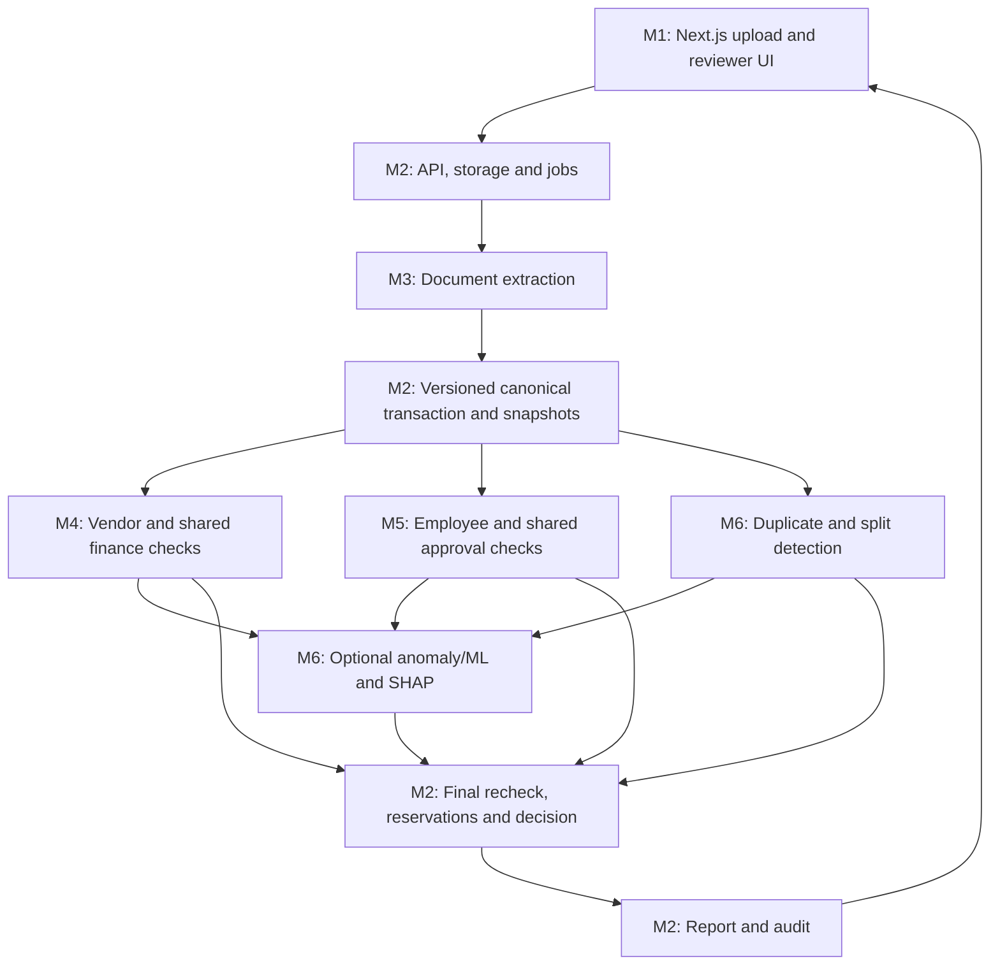

# M5 — Akash: Employee checks and shared approval policy

Proposed assignment for AI BATTALION 1. Read alongside `../AP_Exception_Assistant_Codex_Spec.md` and `../AP_Exception_Assistant_6_Person_Work_Plan.md`. This brief scopes one module; it does not authorize building the entire project or deploying paid services.


**Goal:** validate reimbursement eligibility and calculate required/valid approvals for either branch.

**Own:** `rules/employee/`, shared approval policy evaluator, receipt-share/expense aggregate calculations and employee/approval fixtures. M2 persists approvals and enforces actor authorization on actions.

**Build:**

1. Employee/employment-date and delegated-submission eligibility.
2. Receipt required/present/readable checks using M3's facts and quality state.
3. Expense policy selection by date/category/grade/location/trip.
4. Allowed category/items, business purpose, preapproval, travel class and submission window.
5. Per-item/night/day/trip/month limits with correct denominators and historical aggregation.
6. Company-paid/advance offsets and requested-versus-eligible reimbursement calculation.
7. Shared receipt allocation limits and proposed item allocations.
8. Approval band/chain selection for both vendor and employee transactions.
9. Approval completeness, authority, delegation, separation of duties and material-version invalidation rules.
10. Proposed requirements for waivers, with non-waivable constraints explicitly represented.

**Inputs:** canonical expense/transaction, employee/policy/approval snapshots, receipt facts, prior claim/allocation history. Use fixtures before backend integration.

**Outputs:** `EmployeeCheckResult`, `ApprovalCheckResult`, receipt allocation proposals, required approval steps and evidence-rich rule findings.

**Deliverables:**

- Independent Python package for employee and shared approval checks.
- Versioned demo expense policies and half-open approval amount bands.
- Fixtures for clean claim, over-limit hotel, daily meal aggregation, prohibited category, missing receipt, shared receipt, company card and missing/invalid approval.
- Tests for one versus two hotel nights, aggregate spending, claimant/delegation rules, self-approval and stale transaction versions.
- Clear approval/waiver requirements for M2 and reviewer messages for M1.

**Done when:** INR 15,000 for two verified nights passes an INR 8,000/night check, unknown nights remain unresolved, daily claims aggregate correctly, and both branches identify their missing or invalid approval steps.

**Boundaries:** M6 detects duplicate receipts and potential split patterns; you validate legitimate receipt allocations and daily limits. M4 owns shared arithmetic/budget formulas. You calculate approval requirements; M2 authenticates actors and commits approval actions. Do not set final PASS.

**Specification references:** sections 7, 9.2, 10, 14, 22. Primary tests: T13–T16, T19–T21, T26–T28 with M2, T40 for policy cases.

**First independent task:** implement category/night/day limits and the shared approval-band selector against JSON fixtures.

**Codex handoff prompt:** Implement M5 as deterministic Python over contracts-v1. Cover employee reimbursement policies, receipt allocations, company-card/advance offsets and approval requirements for both branches. Return rule findings and proposals only. Test correct hotel/day denominators, shared allocations, delegation, self-approval and material-version invalidation.


## Shared contracts — agree before implementation


Hold one short kickoff and commit a `contracts-v1` package with sample fixtures. This is the most important dependency for parallel work.

### 2.1 Non-negotiable shared conventions

- One repository, one FastAPI application and one PostgreSQL schema. Do not create six competing servers/databases.
- Python for M2–M6; TypeScript/Next.js for M1. Reuse the stack in the main specification.
- UUIDs identify internal records. Display invoice numbers and fingerprints are separate fields.
- All records/evidence carry tenant/entity context. Server authentication supplies the trusted tenant.
- Financial amounts are decimal strings in JSON and Decimal in Python, always with a currency.
- Missing values use explicit null/status, never silently zero or PASS.
- Final decision: `PASS`, `REVIEW`, `HOLD`. A screening PASS does not execute payment.
- Rule status: `PASS`, `FAIL`, `UNKNOWN`, `NOT_APPLICABLE`, `ERROR`.
- Rule decision effect: `NONE`, `REVIEW`, `HOLD`.
- Every finding carries rule/version and evidence IDs. No unsupported fraud accusations.
- Core finance/risk modules receive immutable inputs and return outputs; M2 alone owns operational database writes and finalization.
- All policy thresholds, dates and reference versions come from inputs; no hidden hard-coded company policy or live clock inside a rule.

### 2.2 Shared contracts

Krishna maintains the shared Pydantic models and generated OpenAPI contract; each producer and consumer reviews its relevant types. This is contract stewardship, not unilateral authority to break another module.

| Contract | Minimum contents | Producer → consumer |
|---|---|---|
| `DocumentBundle` | Document/page IDs, safe artifact references, source type, tenant/entity, integrity metadata | M2 → M3 |
| `ExtractionResult` | Canonical draft, raw fields, quality/validation findings, field provenance, document fingerprints, extractor versions | M3 → M2; fingerprints eventually → M6 |
| `CanonicalTransaction` | ID/version, branch, party, dates, decimal amounts/currency, lines/items, source refs | M2 packages M3 or import output → M4/M5/M6 |
| `ReferenceSnapshot` | Pinned vendor/employee/PO/contract/GRN/policy/budget/approval versions and completeness/freshness | M2 → M4/M5/M6 |
| `HistorySnapshot` | Scoped history, query cutoff, source IDs, prior allocations and candidate-search coverage | M2 repository adapters → M4/M5/M6 |
| `EvaluationContext` | Canonical transaction, references/history, evaluation time, versions, mode | M2 → M4/M5/M6 |
| `RuleResult` | Rule/version, status/effect, observed/expected values, reason code, evidence | M3 validation/M4/M5/M6 → M2 |
| `DuplicateResult` | Candidate IDs/versions, exact/fuzzy/image signals, search completeness, rule findings | M6 → M2 and M6 feature builder |
| `RiskAssessment` | Model status/version, score kind/value, applicability, explanation, recommended review flag | M6 → M2 |
| `AllocationProposal` | PO/GRN/receipt/budget targets, quantities/amounts, basis, snapshot/version | M4/M5 → M2 atomic finalizer |
| `ApprovalRequirement` | Policy/version, required steps/roles, completed/missing/invalid actions, automatic-tier applicability | M5 → M2 |
| `EvaluationReport` | Final decision/completeness, rule findings, evidence, scores, allocations/approvals, next actions | M2 → M1 |
| `ReviewAction` | Typed action, expected versions, reason and evidence; authenticated actor added by backend | M1 → M2 |

Pin actual field names in code before work branches diverge. Documentation and example JSON are not substitutes for executable contract tests.

### 2.3 Module function boundaries

These are proposed application interfaces, not third-party library APIs:

```python
# M3
extract_document(bundle: DocumentBundle, config: ExtractionConfig) -> ExtractionResult

# M4
check_vendor(ctx: EvaluationContext) -> VendorCheckResult
check_shared_finance(ctx: EvaluationContext) -> SharedFinanceResult

# M5
check_employee(ctx: EvaluationContext) -> EmployeeCheckResult
check_approvals(ctx: EvaluationContext) -> ApprovalCheckResult

# M6
find_duplicates(ctx: EvaluationContext) -> DuplicateResult
assess_risk(ctx: EvaluationContext, findings: list[RuleResult],
            duplicates: DuplicateResult) -> RiskAssessment

# M2
run_evaluation(transaction_id, expected_version, mode) -> EvaluationReport
```

Return types wrap `rule_results` plus relevant match/allocation/approval metadata. The backend calls the vendor OR employee branch, shared finance checks, and shared approval checks; it runs risk scoring after its required findings are available. Safe independent checks may run concurrently. A missing module result is incomplete, not a passing result.

### 2.4 Minimal shared rule-result example

```json
{
  "rule_id": "GRN-001",
  "rule_version": "1",
  "status": "FAIL",
  "decision_effect": "HOLD",
  "reason_code": "RECEIVED_QUANTITY_SHORTFALL",
  "observed": {"billed_quantity": "100.00", "uom": "EA"},
  "expected": {"available_received_quantity": "80.00", "uom": "EA"},
  "evidence": [
    {"kind": "TRANSACTION", "id": "30000000-0000-4000-8000-000000000001", "version": 1},
    {"kind": "PO_LINE", "id": "71000000-0000-4000-8000-000000000001", "version": 1},
    {"kind": "GRN_LINE", "id": "76000000-0000-4000-8000-000000000001", "version": 1}
  ]
}
```


## 4. Ownership of areas that otherwise overlap

| Area | Logic owner | Persistence/runtime owner | UI owner |
|---|---|---|---|
| File safety/preprocessing | M3 parsing/quality; M2 intake authorization/scan gate | M2 | M1 |
| Canonical extraction/normalization | M3 | M2 revisions | M1 corrections |
| Monetary arithmetic/date basis | M4 | M2 | M1 |
| Vendor/three-way matching | M4 | M2 reference/allocations | M1 |
| Employee policy/receipt allocation | M5 | M2 reference/allocations | M1 |
| Budget calculation | M4 | M2 locks/ledger/final recheck | M1 |
| Approval requirement/validity | M5 | M2 identity/actions/transactions | M1 |
| Duplicate algorithm and split signals | M6 | M2 scoped retrieval/resolutions/locks | M1 |
| Image fingerprint generation/comparison | M3 generates; M6 compares | M2 | M1 |
| Risk scoring and SHAP | M6 | M2 jobs/registry activation | M1 |
| PASS/REVIEW/HOLD and report assembly | M2, following main spec | M2 | M1 displays |
| Human feedback labels | M6 taxonomy/training use | M2 action/label history | M1 |
| Security/reliability | Every module for its boundary | M2 platform | M1 safe UI |
| Tests | Every module owner | M2 integration harness; all contribute | M1 browser suite |

No new role is implied by an overlap: distinguish calculation, persistence and display so each change has one implementation owner.

## 5. How the pieces connect



Backend call order:

1. Accept file/import and assign IDs; store original and enqueue.
2. M3 returns facts/evidence, or validated structured import supplies canonical facts.
3. M2 persists revision and assembles immutable authorized snapshots.
4. Run branch checks: vendor → M4, employee → M5. Run M4 shared finance and M5 shared approvals on both applicable branches.
5. M6 evaluates duplicates/split signals using scoped history; then builds risk features from the required findings.
6. M2 checks completeness/precedence, rechecks live capacity and versions in its finalization transaction, commits reservations/decision/audit and generates a report.
7. M1 displays it. Human actions go back through M2, producing new versions/evaluations rather than editing old results.

## 6. Work in parallel without waiting for each other

| Member | What to substitute while dependencies are unfinished |
|---|---|
| M1 | Mock API server returning contracts-v1 reports and errors |
| M2 | Stub M3–M6 adapters with realistic complete, incomplete and failed results |
| M3 | Local synthetic PDF/image files and fixture extraction responses |
| M4 | Canonical JSON plus vendor/PO/GRN/contract/budget snapshots |
| M5 | Canonical claim JSON plus employee/policy/approval/history snapshots |
| M6 | Canonical/history JSON and sample fingerprints; no production database or labeled corpus required for matching baseline |

Mocks must use the same contracts as real adapters and be visibly designated as mocks. Never let fixture results masquerade as actual live extraction or model output. Every module should have one command to run its fixtures and one to run its tests.

## 7. Integration milestones

No project deadline was supplied; use these as ordered checkpoints, not promised dates. Agree on dates as a team.

| Milestone | Everyone's concrete output | Integration gate |
|---|---|---|
| A — Shared agreement | Contracts-v1, ownership map, clean vendor/employee fixtures and three report states | All six members can load the same fixtures |
| B — Independent skeletons | Each module runs its smallest example; frontend uses mocks and backend stubs | Contract tests pass; no secrets/live services required |
| C — First combined slice | One vendor and one employee case traverse real API, real rules, fixture extraction, rules-only mode | UI shows persisted real findings and evidence |
| D — Document and finance completeness | Live extraction adapter, PO/GRN/policy/approval/budget, exact/fuzzy/image matching | Golden finance cases and uncertainty routing pass |
| E — Review and integrity | Corrections, stale versions, allocation concurrency, audit replay and failure handling | Retry/security/concurrency tests pass |
| F — ML and release polish | Optional measured ML/SHAP, performance results, deployment configuration and demo | Honest capability list and reproducible team demo |

Integrate at milestone C, not after everyone has finished all features. M3's real provider and M6's trained model must not block a functional rules-first project. Later replace fixture/stub adapters one at a time, keeping the combined tests green.

## 8. Repository and merge rules

Use one monorepo and short-lived branches such as `m1/frontend-queue`, `m2/evaluation-api`, `m3/extraction-adapter`, `m4/three-way-match`, `m5/expense-policy` and `m6/duplicate-engine`.

- Each person edits their owned module and tests. Cross-module changes require the other owner's review.
- Krishna coordinates shared contracts, migrations, backend dependency manifests, main router and deployment files; Vansh coordinates frontend dependencies and integration checklist.
- Do not independently modify shared enums, response fields or amount formats. Propose a versioned contract change with sample data and producer/consumer updates.
- PRs state behavior, inputs/outputs, tests and required schema/config changes.
- Keep changes small; merge often. Avoid a final-day merge of six large branches.
- No direct database access from UI; no private copies of shared contracts; no CSV file pretending to be the production database.
- Module owners submit schema requirements to M2 and provide migration test fixtures; they do not create competing databases.
- Shared fixtures and integration tests are committed and reviewed. Generated clients come from the shared API contract.

## 9. Universal handoff checklist

Every member delivers these items; a notebook or screenshot alone is not a module handoff.

1. Runnable code in the owned folder and exact setup/run instructions.
2. Contract-conforming input/output types, at least one clean and one exception fixture, plus one missing/error fixture.
3. Meaningful unit/contract tests and actual test results.
4. Known assumptions, unsupported cases and configuration requirements.
5. Evidence IDs preserved end to end; decimal/currency and tenant conventions respected.
6. Dependencies pinned through the shared project workflow; no credentials or personal data in Git.
7. A short demo of the module working independently.
8. A paired integration check with its producer/consumer owner.

## 10. Combined-project acceptance demo

The team is ready to combine/release the first working version when it can demonstrate:

1. Clean vendor invoice → matched PO/GRN, adequate budget and approvals → PASS with evidence.
2. Already-paid duplicate → HOLD citing prior invoice; no duplicated reservation.
3. Partial goods receipt/prior consumption → HOLD with the exact quantity difference.
4. Clean employee claim → PASS; over-limit/missing-receipt claim → correct REVIEW/HOLD.
5. Similar receipt image → explainable candidate comparison, with a legitimate shared-receipt counterexample.
6. Human correction/additional approval → new evaluation; original report/audit remains visible.
7. Two concurrent claims competing for budget/receipt capacity → no over-allocation.
8. ML disabled/unavailable → truthful status and configured safe behavior, never fabricated scores.

The main specification's detailed acceptance tests remain authoritative. This document divides ownership; it does not remove finance, evidence, security or reliability requirements.

## 11. Distribution instructions

Give each person the main specification, this shared plan, and their own `M#_...md` brief. Each brief repeats the common contracts and integration guidance so it can be used in a separate Codex task with the main specification. Do not ask six separate tasks to each build the entire application; tell each one its module boundary and the shared contracts.

Immediate next step: agree on the proposed member assignments, freeze contracts-v1 together, then everyone starts the first independent task listed in their brief.
