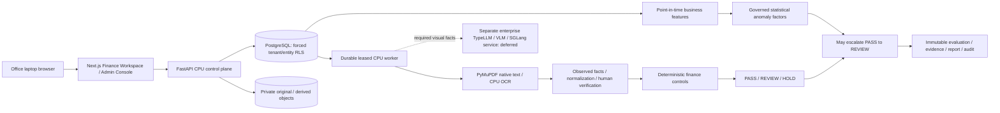

# Release architecture

This is a retained synthetic development application with locally verified release artifacts. It is not a deployed enterprise pilot. See [capability matrix](release_matrix.md) and [deployment runbook](runbooks/enterprise-pilot.md).

Finance clients need no GPU, CUDA, model weights or inference runtime. Native parsing and CPU OCR remain in the control worker. The planned inference service is separately authorized and scaled; neither it nor extraction routing makes a finance decision. Money enters extraction as strings and becomes Decimal only through normalization. Uncertain critical facts remain unresolved.

Development identity is explicitly loopback-only. Enterprise mode validates Entra v2 RS256 tokens against fixed issuer/audience/tenant and approved calling clients, then resolves server-owned memberships to tenant/entity/actor/roles. Token role claims and supplied UUIDs grant no authority. Enterprise configuration requires private managed-identity Blob and verified database TLS; business sessions reject superuser/RLS-bypass roles. Hosted authentication and real Azure access remain externally unverified.

Azure Bicep defines one private CPU architecture: internal Container Apps, separate web/API/worker identities, private PostgreSQL 16, private Blob, Key Vault, registry, private endpoints/DNS and Log Analytics. Web ingress remains inside the approved enterprise network. API/worker receive only named Key Vault secret scopes; only API/worker receive document-container access. The foundation and release are separate. No GPU resource is created by these templates.

Historical financial facts, reference versions, extraction runs, source corrections, evaluations, labels and ledger/audit events are append-only. Current eligibility is a projection that becomes stale after material changes. The existing scoped admission lock, leases and operation keys prevent duplicate financial effects. Cancellation releases capacity through compensation, preserving original decisions. Phase 6 adds no business tables, replacement finance engine or payment executor.

Reference administration reuses staging/validation/activation. Allowlisted business forms create drafts/new versions; a policy administrator cannot activate vendor or financial master records. Budget adjustments use the existing ledger. Intelligence authors and governors remain distinct; artifact code/schema/digests are checked. A code-changing release may make an older artifact unavailable; it must be rebuilt/shadowed/promoted through governance, never relabeled as compatible.

Structured telemetry records route templates, status, duration and correlation only. Workload metrics derive from persisted state. Public health is minimal; dependency internals require operational/auditor authorization. A configured cloud provider is not labeled healthy without verification.
