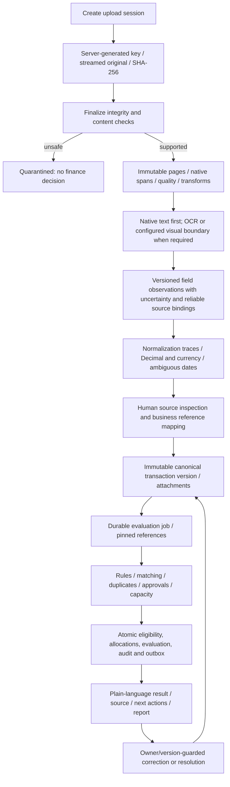
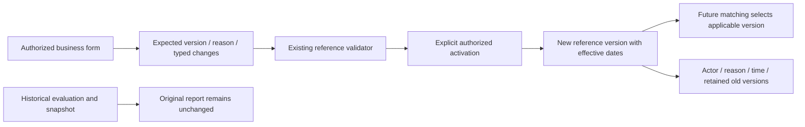

# Document, decision and administration data flows

Originals never become corrected documents. Derived previews are separate objects; page numbers are 1-based and boxes are shown only when measured coordinates exist. Import evidence retains batch/sheet/row/column/raw/parsed/validation. A spreadsheet attachment flag is insufficient without an actual document link. Spreadsheet formulas are not executed; CSV exports escape executable prefixes.

The hotel demonstration changes INR 8,000 to 9,000 per eligible night from 2026-11-01. Integration tests check both sides of that date, version conflicts, scoped permissions and the immutable prior snapshot. Browser tests retain the historical report and show the activation reason/version history.

Intelligence operates on already canonical facts, separately from document VLM extraction. Features exclude current/future facts and incompatible currencies. Statistical factors may request REVIEW and cannot clear HOLD. No representative supervised dataset exists; classifier probability, calibration and SHAP are deferred.
