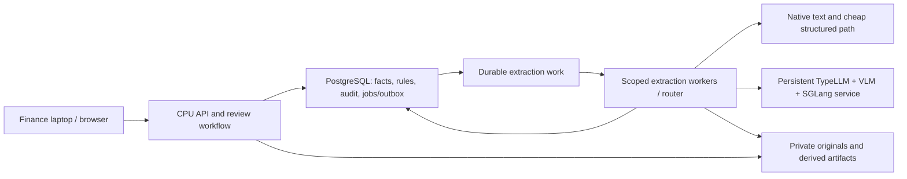
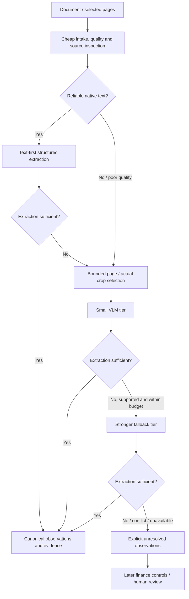

# Optimized enterprise extraction architecture

Accepted design on 2026-10-03; basis: the user-approved Phase-0 closure, specification sections 3–4 and 18–19, and [ADR-0008](adr/0008-optimized-enterprise-inference.md). The later phases implement the CPU application, native/OCR preprocessing, durable routing and provider boundary. The 2026-10-04 priority override establishes real local experimental TypeLLM/VLM/SGLang serving in [ADR-0015](adr/0015-current-driver-compatible-real-vlm.md). Larger fallback tiers, production shared serving and representative quality/capacity remain future work.

## Current executed local path

`upload → preprocessing → native/OCR mapping coverage → real visual header and bounded row generation → independent reconciliation → trusted Decimal normalization → source verification/correction → existing deterministic finance engine` is operational for the tested cases. Complete native PDFs remain cheap. Incomplete native/OCR mapping escalates even with high native-text coverage; known segmentation uncertainty requires confirmation. Routing never decides finance eligibility.

The resident small BF16 model runs in an isolated CUDA-12.4 environment and the actual TypeLLM client in a separate CPU environment. The finance application has no new GPU dependency. Generation is serialized with cache flushing, safe error handling and explicit metadata. Measured uniform-grid crops retain actual source mappings and unknown field boxes. Both provider outputs are retained on row-count disagreement; all affected candidates remain ambiguous. See [acceptance measurements](real_vlm_acceptance.md) and [run commands](runbooks/local-inference.md).

## Goals and planes

Preserve extraction quality and source evidence while reducing unnecessary visual calls and average inference cost. Support ordinary finance laptops, shared enterprise serving and independent scaling. Neither typed generation nor an expensive model establishes financial truth.

| Plane | Responsibilities | Deployment boundary |
|---|---|---|
| Finance client | Supported browser/client, upload, authorized review and job status | Laptop needs no NVIDIA GPU, CUDA, model weights, TypeLLM, SGLang or GPU Docker. |
| Control plane | FastAPI, PostgreSQL, authenticated scope, deterministic finance rules, approvals, budgets, audit, review workflow, reports and durable job/outbox metadata | Central CPU-friendly services; API/frontend/rules/database scale independently of GPU capacity. |
| Inference plane | Preprocessing, ExtractionRouter, TypeLLM client, compatible VLM, SGLang serving, private model/artifact caches, leased extraction workers | Separate shared enterprise GPU service/worker pool. CPU preprocessing can be separated from GPU serving. |

TypeLLM supplies bounded typed scalar generation through the replaceable adapter; it does not supply a finance decision or a verified native table/bbox interface. The VLM interprets required visual content. SGLang is the intended inference runtime; compatible scheduling/batching remains to be validated on the selected tuple. Finance rules consume canonical facts with provenance and explicit uncertainty regardless of extraction path. [RULES_ONLY](adr/0007-rules-only-finance-risk-baseline.md) is a finance-risk configuration, independent of whether document extraction eventually uses VLM.

## Routing and sufficiency

The implemented router uses page quality, native-text availability and explicit header/row mapping coverage. The future extension adds richer supported-family/table complexity and model-tier/resource selection. It never emits PASS/REVIEW/HOLD. No routing implementation or quality thresholds were invented in Phase 0; historical design sections below describe the intended enterprise extension.

A digital PDF with reliable native text can complete the cheap structured path without visual inference. Scans, photographs, corrupt/low-coverage text, difficult tables/layouts, ambiguous fields and visual evidence can require VLM. The cheap path may use deterministic parsing or an appropriately validated structured extractor; its implementation and any model are later selections. Finding text is not enough: its field/page binding, reading order and completeness must be checked. A syntactically valid candidate is not sufficient evidence.

Sufficiency is defined by a versioned, family-specific quality policy validated on representative documents: required critical-field states and raw text, independent source binding, supported row completeness, no unresolved contradiction and applicable document limits. A model's self-reported confidence alone cannot satisfy it. Missing critical facts, guessed values and fabricated rows remain unresolved. NOT_APPLICABLE needs a legitimate applicability basis; it is not a shortcut past unknown data. Extra calls must be bounded by pages, rows, attempts, time and cost, with budget exhaustion explicitly recorded.

A stronger fallback must preserve previous attempts and disagreement. It cannot silently replace conflicting amounts or identities merely because it is larger. Unresolved facts go to later normalization/controls and human examination. A completed extraction result means only that the extraction operation finished; it cannot imply transaction eligibility or complete mandatory finance controls.

## Page and crop provenance

Future preprocessing can select a specific page, header crop, totals crop, PO/reference crop, table region or receipt region at a bounded resolution. Actual detection, rendering, rotation and transforms belong to later ingestion/preprocessing work. Current synthetic annotations are not detected visual regions.

Each derived artifact must bind its immutable original document/version, original page, checksum, dimensions, preprocessing version and actual transform. Record a crop extent only if it was really produced. A crop extent is not a field bounding box. A known input page can establish page provenance; factual field-location accuracy still needs independent verification. Map any supported field box back to normalized original-page coordinates, with its real transform/coordinate system, before using it as evidence. Unsupported or unverifiable boxes remain None. Never manufacture coordinates from model answers or annotation labels. See [storage ADR](adr/0006-private-original-and-derived-storage.md).

## Metadata and provider modes

| Concept | Current contract | Planned metadata / responsibility |
|---|---|---|
| Input and scope | DocumentBundle UUIDs, document version, tenant/entity and ordered one-based pages | Bind authenticated job scope; preserve original/artifact digests and source-quality assessments. |
| Results | extraction-v1 observations, explicit five states, raw/candidate strings, bounded flat rows, evidence and extraction status | No provider-specific finance semantics. Keep raw text separate from normalized authoritative values. |
| Versions | AdapterMetadata and VersionMetadata already identify provider/model/runtime/schema/prompt/preprocessing versions where known | Record verified immutable revisions rather than marketing names; unknown values remain unavailable. |
| Routing sidecar | Not implemented; no new extraction-v1 keys | Future versioned record binds run/document/version/scope, route-policy/quality-policy versions, route, tier, fallback reason, attempt lineage and unresolved critical fields. |
| Region sidecar | Not implemented | Region kind, original page/dimensions, actual crop extent, orientation/transform, derived artifact hash/version, nullable factual field bbox. |
| Runtime observations | Optional Decimal elapsed value; fixture latency unavailable | Future measured queue wait, preprocessing, cold/warm model time, end-to-end time, peak VRAM, failures, budgets and retry counts. No fabricated defaults. |

Use a separate explicitly versioned sidecar/envelope in later work; strict extraction-v1 JSON must not receive speculative unknown fields. Future schema changes need migration/versioning and tests. The existing boundary is sufficient for Phase 0; no router class or schema change is necessary today. [Contract catalog](data_dictionary.md#phase-0-contract-version-catalog) records what actually exists.

- **FIXTURE:** implemented deterministic synthetic development/test adapter; no GPU or paid provider. Select it explicitly for synthetic work.
- **ENTERPRISE_VLM:** future deployment mode using shared TypeLLM/VLM/SGLang inference behind the same adapter boundary; not implemented or production approved.
- **TEXT_FAST_PATH:** a future routing path within extraction, not an alternative finance-risk decision mode. It must meet the same evidence/uncertainty contract.

A live outage cannot switch a real document to fixture answers. Deployments must explicitly configure compatible providers and supported capabilities before accepting live extraction work.

## Async execution and failure behavior

Upload → accepted metadata/work intent → queued job → leased worker → extraction result persisted → UI receives/polls scoped status. The browser must not wait synchronously through model execution. Original-object availability must be established before work is eligible; object writes cannot share a database transaction. Use staged writes, reconciliation and explicit availability state as described in [ADR-0005](adr/0005-durable-jobs-and-isolated-workers.md) and [ADR-0006](adr/0006-private-original-and-derived-storage.md).

PostgreSQL durable jobs/outbox is the initial queue design. Workers have at-least-once delivery, leases, heartbeat/recovery, bounded retry/backoff, timeout, cancellation, explicit failure/provider-unavailable state and dead-letter/manual recovery. Versioned stage/idempotency keys and guarded writes prevent duplicate effects; a file hash alone is not transaction identity. Reject stale revisions/leases and canceled or superseded results at finalization. Preserve sanitized failure codes, attempts and audit events, never private reasoning/raw exception bodies.

Multiple workers may consume the queue later. Fair scheduling and per-tenant quotas/backpressure bound resource use. Separate control-plane health from provider availability: GPU outage should leave authorized status/review APIs usable while extraction remains incomplete. Circuit breaking avoids retry storms. Cancellation of a client request does not guarantee immediate GPU abort; measure runtime behavior and prevent late results from committing.

Never translate timeout, unavailable service, empty answer or missing dependencies into successful empty extraction, zero risk or PASS. Preserve FAILED/PARTIAL/UNSUPPORTED or incomplete processing as appropriate; later mandatory finance controls determine REVIEW/HOLD. That finance routing is not implemented today.

## Serving and optimization

Load a selected model once into a persistent service, keep it resident and serve many requests. Do not load weights per invoice. Maintain health/readiness, bounded concurrency, request/image/token limits and memory reservations. Separate tiers can have resident pools; cold loads and fallback contention must be included in capacity tests.

Benchmark supported SGLang continuous batching/scheduling with concurrent representative tenants and varied document sizes. Do not assume a published feature establishes the selected VLM path's throughput or numerical behavior. Preserve tenant isolation even when the same model process serves many users. Test fairness, overload, queue wait, tail latency, OOM recovery and retry impact.

Private caches can reuse preprocessing/extraction results only when tenant/entity, document revision/hash, source artifact/transform, extraction schema, provider/model/tokenizer/prompt/preprocessing versions, routing/quality policy and relevant options match. Verify permissions and freshness on every retrieval. Cache extraction facts, not finance PASS decisions; changed policy/reference snapshots require fresh finance evaluation. No cross-tenant document-result reuse. Any inference prefix/KV cache sharing needs isolation/retention controls and verification; default to partitioning or disabling document-derived reuse across tenants. Public model weights can be centrally cached under license without treating private content as public.

Scale inference workers/model pools horizontally and independently from API/frontend/finance rules/PostgreSQL. GPU pool capacity remains a measured resource constraint, not automatically proportional to worker count. Future autoscaling can use queue depth/age and utilization, retain minimum warm capacity where latency matters, and scale down during low demand while accounting for cold start and cost. No autoscaler is implemented; no zero-cost serverless GPU promise is made.

## Model tiers, quantization and benchmark plan

No production model is selected. Existing [research pins](typellm_spike_plan.md) preserve TypeLLM 0.5.1, SGLang 0.5.21 and the proposed Qwen3.5-4B revision/container digest. The 4B TypeLLM image path is unverified. Upstream text tests and the larger recorded image checkpoint do not establish the proposed tuple's compatibility. No new model search/download is authorized by this closure.

A later suitable-host benchmark must first pass runtime/image/safety prerequisites, then compare higher-precision baseline, small tier, stronger fallback, native-text routing and the complete cascade on versioned, representative independently annotated documents. Keep tuning and holdout cases separate; include clean, scanned, rotated, poor-quality, obstructed, multi-page, table/receipt and adversarial-text cases plus unsupported/unavailable cases. The current ten-case structured replay set is a contract test and cannot substitute for actual image documents.

| Criterion | Required future measurement |
|---|---|
| Critical-field exact match | State, raw value and normalized candidate accuracy per critical field with explicit denominators; compare money as exact trusted Decimal/string values. |
| Uncertainty/abstention | Expected abstention coverage, unsupported-field guesses, missing critical observations and false claims of certainty; include failed/time-limited attempts. |
| Rows | Discovery completeness, extra/duplicate/truncated rows, row/column binding and exact per-field agreement, including repeated headers and multi-page tables. |
| Evidence | Independently verify page/field locators and original-page transforms; measure factual correctness separately from mere locator availability. |
| Hardware/model size | Exact model revisions, licenses, precision, on-disk bytes, loaded/peak VRAM and reserve, CPU/RAM/storage and runtime/kernel/container versions. |
| Latency and throughput | Queue wait, preprocessing, cold start, warm extraction, end-to-end p50/p95 and documents/second under bounded concurrent load, retries and fallback frequency. |
| Precision degradation | Compare supported quantized variants against the same higher-precision baseline, cases, prompts and preprocessing; report critical-field/abstention/row regressions. |
| Operations/cost | Failure/OOM/outage recovery, offline/egress behavior, tenant isolation, cancellation, batching contention, maintenance and deployment/license complexity, cost per resolved document. |
| Cascade quality | Measure each path and full system; count routing misses, attempted tiers, unresolved outcomes, resource savings and disagreement. Cheap-path selection must not hide quality loss. |

FP8, FP4, INT4, AWQ and GPTQ are possible evaluation families only where the specific model/runtime/hardware officially supports them. They are not interchangeable compatibility promises or approved production formats. Accept a tier/format only after its measured finance-extraction quality meets approved thresholds against the higher-precision baseline; never silently trade reliability for smaller weights. No quantized quality result exists today.

Benchmark gates must approve reproducible pins, exact money strings, honest null/state mapping, row bounds, sanitized errors, reasoning suppression, verified source bindings, retention and license terms before real-data pilot use. The fixture release supports development independently of these infrastructure gates.

## Targets and measurements

| Category | Proposed target / decision still needed | Measured real TypeLLM/VLM result here |
|---|---|---|
| API responsiveness | Spec section 19.3 proposes metadata APIs p95 <2 seconds; validate later. | Unavailable; no application/API exists. |
| End-to-end document processing | Spec proposes typical 1–3-page processing <90 seconds; deployment/workload target, not an extractor-only SLA. | Unavailable; no real inference executed. |
| Critical-field quality | Spec proposes >=95% on clean cases and complete abstention on curated unreadable fields; owners must approve representative benchmark gates. | Unavailable; fixture replay agreement is not measured image accuracy. |
| VRAM / throughput / cost / cold start | Set budgets and release thresholds from the selected enterprise host/workload benchmark. | Unavailable, not zero. |

No real image quality, latency, VRAM, throughput, quantization or cascade metric is inferred from the local inventory or fixture timings.

## Deployment profiles

| Profile | Architecture | Current status |
|---|---|---|
| Developer | Existing CPU-only fixture contracts/tests/harness; no GPU, CUDA, paid provider or cloud account required. Later local API/storage follows the same boundary. | Fixture tooling verified; API/frontend/database/queue/storage adapters not scaffolded. |
| Enterprise pilot | CPU web/API/database/rules plus separate shared GPU inference service, private object storage and scoped durable jobs. Finance users access the supported client/browser. | Accepted design; identity, infrastructure, licenses/data terms and real benchmarks are future gates. |
| Scale-out enterprise | Independently scaled API/queue and multiple inference workers/model pools with monitoring, fair scheduling, bounded caches and later autoscaling. | Future design; capacity and cost unmeasured. |

The observed developer host does not need to be repaired to complete Phase 0. Its recorded driver 550.120 fails the proposed CUDA 13 >=580 prerequisite; Docker daemon access is denied and GPU passthrough unverified. No runtime was installed. Use a separately authorized suitable inference host for future experiments. Ordinary finance-user laptops do not require GPU/VLM runtime.

## Decision records and closure

[Identity](adr/0003-trusted-identity-and-record-keys.md), [effective policy](adr/0004-effective-versioned-policy-selection.md), [jobs](adr/0005-durable-jobs-and-isolated-workers.md), [storage](adr/0006-private-original-and-derived-storage.md), [RULES_ONLY](adr/0007-rules-only-finance-risk-baseline.md) and [enterprise inference](adr/0008-optimized-enterprise-inference.md) are accepted design decisions, not deployed capabilities. [Phase-0 exit review](phase0_exit_review.md) records qualified closure and deferred suitable-host benchmarks. This document creates no Phase-1 implementation.

## Phase-2 application integration update — 2026-10-03

The historical research pins and external runtime observations above are preserved.
Phase 2 now implements bounded CPU preprocessing and native-first routing, actual
English CPU OCR, raw observations/normalization/source corrections and a remote
TypeLLMExtractionAdapter. The optional pinned 0.5.1 SDK generate contract uses flat
state/string questions and application-managed bounded page/row requests. Its
real wheel schema compiler accepted 42 flat header questions without inference.
Mocked generate tests exercise null/float/authority/timeout/disagreement behavior.
The transport requires an approved endpoint/model and preprovisioned local tokenizer
assets, with local-only loading; no tokenizer/model download or local serving occurs.

Actual CPU document results identify NATIVE_TEXT or LOCAL_OCR. FIXTURE replay is
separate and is never a provider-outage substitute. Routing/status metadata lives
in extraction-routing-v1 beside the unchanged strict extraction-v1 contract.
Unknown critical facts and uncertain table/segmentation coverage require input;
manual source verification remains mandatory for document-derived screening.
The router never chooses PASS/REVIEW/HOLD. The Phase-1 engine remains authoritative.

No enterprise model/endpoint is configured here. Live TypeLLM/SGLang/VLM execution,
GPU latency/VRAM/quality, production model selection, stronger model fallback,
actual crops, batching and quantization remain explicitly deferred to suitable
separately authorized infrastructure. The NVIDIA/Docker prerequisites were not
retested or repaired. Native/OCR synthetic measurements establish no live-model
accuracy. See the [Phase-2 exit review](phase2_exit_review.md) and
[local runbook](runbooks/phase2-local.md) for implemented behavior and limits.
