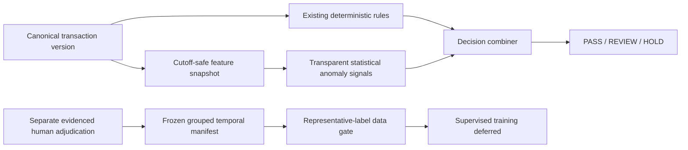

# Finance intelligence

Phase 5 adds an immutable intelligence sidecar to the existing transaction and
evaluation architecture. Finance rules remain authoritative. Current supported
deployment is transparent statistical anomaly review in synthetic development;
supervised training is not justified by available data. Extraction VLM/TypeLLM
is separate and remains externally deferred.

The actual inventory at entry found 200 synthetic vendor scale inputs, a
disposable 10k vendor performance generator, five retained synthetic history
references and **zero adjudicated training labels**. Existing correction/request/
resolution actions and golden expected decisions are not supervised targets.
No classifier, Isolation Forest, calibrated probability, PR-AUC, Brier score or
SHAP has been fabricated. Synthetic pipeline tests do not prove generalization.

See [the model card](model_card.md), [Phase-5 runbook](../docs/runbooks/phase5-local.md)
and [ADR-0013](../docs/adr/0013-point-in-time-statistical-intelligence.md).
Schemas are in `contracts/`; runtime artifacts, private dataset manifests,
uploads and generated measurement reports remain outside Git.

`app.risk.features` is the provider-independent feature builder;
`app.risk.anomaly` scores/combines without changing any deterministic rule;
`app.risk.datasets` defines sampling, grouped temporal splits and the gate.
`app.services.intelligence` reuses existing scope locks, private storage,
review ownership, evaluations, audit and idempotency. Twelve additive forced-RLS
tables persist immutable facts; no parallel reviewer or transaction system exists.

Historical versions are selected **before** party/currency/cohort filtering.
Only knowledge strictly before the cutoff enters history. Current transaction
UUID/all revisions, later corrections, payments, approvals, settlements,
review outcomes and labels are excluded. A backdated golden evaluation remains
a rules test, but its later-created canonical input supplies no historical ML
values. References without trustworthy availability cannot be backdated; source
registration records current server-observed knowledge time.

The vector contains business numeric/boolean features and explicit null/missing
indicators. UUIDs, invoice numbers and party identities support joins, number
comparison, grouping and lineage, but raw identifiers/names/accounts/contact/
protected attributes never enter predictors. Same-currency monetary cohorts only;
there is no FX transformation. Decimal remains authoritative for money operands;
floating feature values are diagnostics, not financial amounts or ledger effects.

The manifest freezes transaction/evaluation/label/feature IDs and digests,
taxonomy, cutoffs, source version, boundaries, filters, exclusions and split
assignments. Related revisions, document hashes/source IDs and duplicate
comparisons form connected groups. Groups crossing chronological boundaries are
excluded; designated unseen parties are absent from earlier splits. PASS audit
sampling uses a stable SHA-256 campaign/evaluation hash and opens existing review
cases without changing screening or labeling PASS as clean.

No online learning, automatic retraining, automatic promotion or Phase-6 hosting
exists. Real supervised work requires representative authorized final adjudications,
approved policies/target/capacity, frozen splits, a reviewed gate and separate
offline training plus governance approval. A future classifier must bind its schema,
dataset, code/dependencies, seed, output space and held-out evaluation; current
`SUPERVISED_DEFERRED` runs produce no weights.
